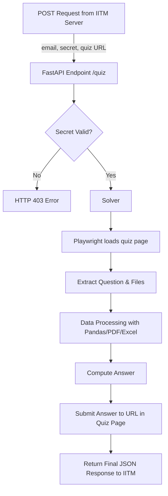

# 🧠 Quiz Auto-Solver using LLMs, Playwright & FastAPI

Automated system to solve web-based data quizzes given by IITM (TDS course).  
The system receives quiz URLs, extracts data from JavaScript-rendered pages, downloads files, performs analysis, and submits answers back within time limits.

---

## 🚀 Features

- Fully automated quiz solver via HTTP POST endpoint  
- Headless browser rendering using **Playwright**
- Reads encoded HTML (`atob`) and DOM content
- Supports:
  - CSV, Excel, PDF parsing
  - Numeric computation
  - Text extraction & cleaning
- Automatically submits answers to the provided endpoint
- Time-bounded solver (170 sec limit)
- MIT-licensed public GitHub repo (as required)

---

## 🏗️ System Architecture



---

## 📌 API Specification

### ▶ Endpoint
```
POST /quiz
```

### 📥 Request JSON
```json
{
  "email": "your-email",
  "secret": "your-secret",
  "url": "quiz-url"
}
```

### 📤 Successful Response
```json
{
  "status": "ok",
  "elapsed_sec": 52.1,
  "result": { ... }
}
```

### ❌ Invalid Secret Response
```json
{"detail": "Invalid secret"}
```

---

## 🔐 Environment Variables

> Do NOT commit your `.env` file.  
> Commit only `.env.example`

### `.env.example`
```
YOUR_EMAIL=example@example.com
YOUR_SECRET=your_secret_here
```

You must set these in Railway → **Variables**.

---

## 🏃‍♂️ Local Development

### 📦 Install dependencies
```bash
pip install -r requirements.txt
```

### 🧪 Install playwright browser
```bash
playwright install chromium
```

### ▶ Run FastAPI Server
```bash
uvicorn app:app --reload
```

Server runs at:
```
http://127.0.0.1:8000
```

---

## 🌐 Production Deployment (Railway + Docker)

This repo includes a **Dockerfile** using:

```dockerfile
FROM mcr.microsoft.com/playwright/python:v1.47.0-focal
```

Once you push the code to GitHub:
1. Open Railway → Deploy from GitHub
2. Add environment variables:
   - `YOUR_EMAIL`
   - `YOUR_SECRET`
3. Railway auto-builds and exposes an HTTPS URL.

Your submission URL will look like:
```
https://yourapp.railway.app/quiz
```

---

## 🔍 Testing Against the Demo Endpoint

Replace `<YOUR_DEPLOYED_URL>`:

```bash
curl -X POST "<YOUR_DEPLOYED_URL>/quiz" \
  -H "Content-Type: application/json" \
  -d '{
    "email": "YOUR_EMAIL",
    "secret": "YOUR_SECRET",
    "url": "https://tds-llm-analysis.s-anand.net/demo"
  }'
```

---

## 📚 Viva Questions & Suggested Answers

### 💬 Why use Playwright?
> The quiz pages are JavaScript-rendered and contain dynamic DOM content. Static HTTP scraping cannot execute JavaScript, so Playwright was required.

### 💬 Why a time limit?
> IITM server will give multiple chained quizzes within 3 minutes. To ensure safety, a solver timeout of 170 seconds prevents failure.

### 💬 Why pandas/pdfplumber?
> Quizzes may provide PDF, CSV, or XLSX files. pandas + pdfplumber provide a unified interface for parsing them.

### 💬 Why store the secret in environment variables?
> Hardcoding violates security policy and can break evaluation. Env variables keep the secret private.

---

## 📝 License

This project is licensed under the **MIT License**.

---

### 🎉 Credits
Developed for IITM BSc Data Science – Tools in Data Science Assignment: **Automated Quiz Solver**.

